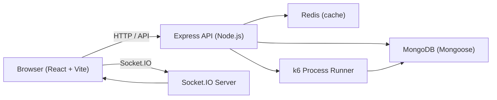
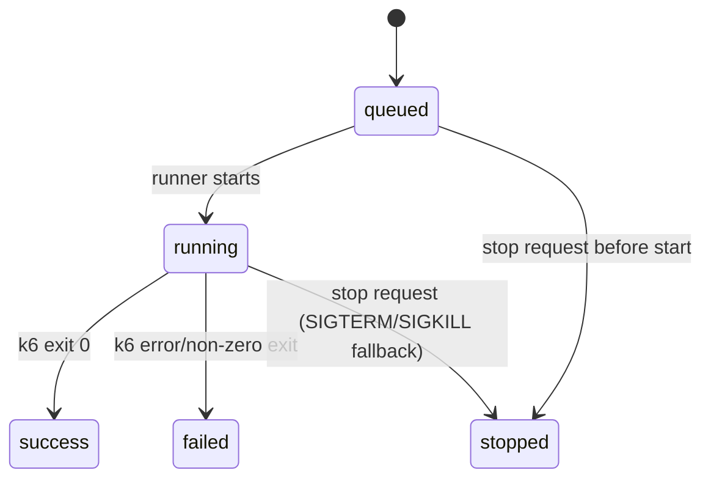
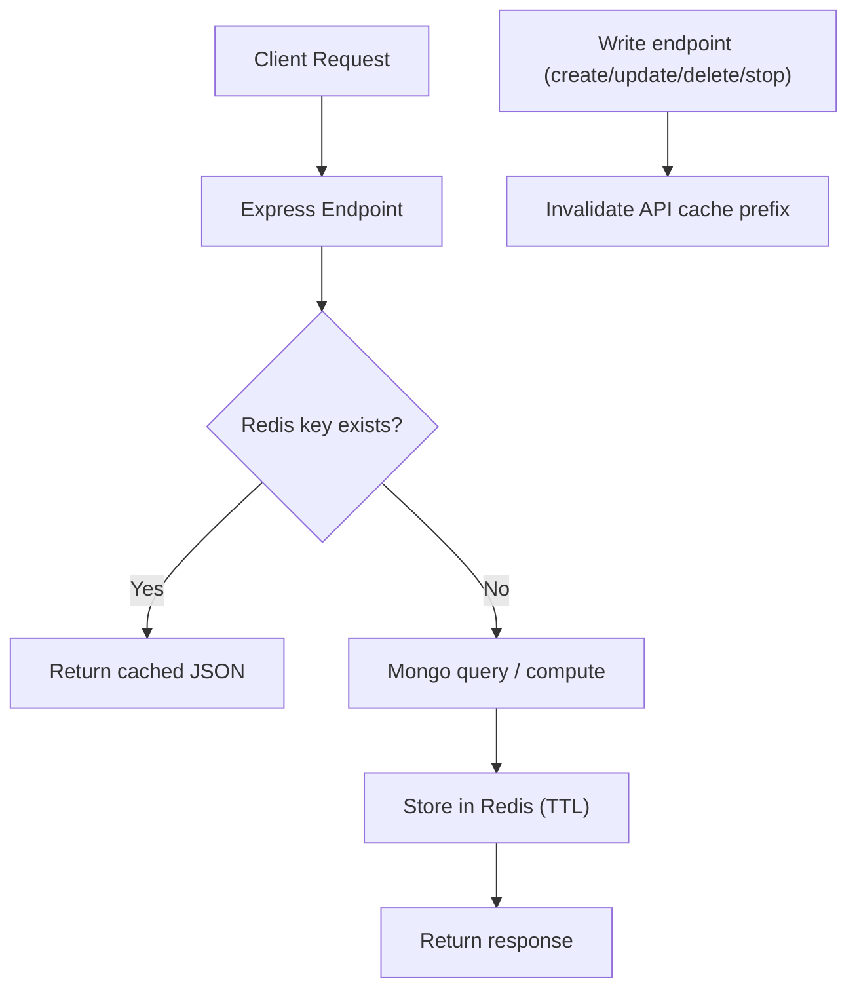
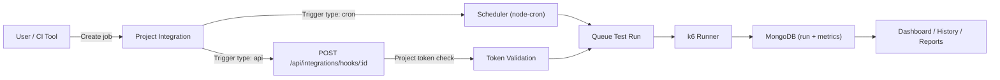

# LoadPulse

LoadPulse is a project-based website performance testing workspace built with React, Node.js, MongoDB, Socket.IO, k6, and Redis.

It helps teams run performance tests, monitor live metrics, review history, and collaborate with project-level access control.


## Status

This project is still under active development.

You may still encounter evolving flows, incomplete edges, or occasional bugs.

## Core Features

- Multi-project workspace (each project has its own URL, history, and dashboard)
- Concurrent k6 test execution across multiple projects
- Live dashboard metrics via Socket.IO
- Project-wise integrations:
  - Schedule-based jobs (cron + timezone)
  - API hook jobs for external triggers
  - Project token management (generate/revoke/regenerate)
- Per-test detail pages with real-time charts
- Test history with search/filter
- Stop active tests from:
  - Test History
  - Test Details
- Project sharing by email with granular permissions:
  - view
  - run
- Local auth (username/password)
- Optional GitHub OAuth login
- Optional authenticator-based 2-step verification (TOTP)
- Admin console for user management
- Redis-backed API caching for read-heavy endpoints

## Screenshots

### Login


### New Test


### Test History


### Reports


## Product Areas

- `Projects`: create/select projects and manage project metadata
- `Dashboard`: project overview, live run cards, and recent run summary
- `New Test`: configure VUs/duration/target and run k6
- `Test History`: browse, search, delete, and stop runs
- `Reports`: project-focused analytical view
- `Integrations`: schedule tests or trigger them from external systems via secure hooks
- `Settings`:
  - User Settings
  - Security
  - Access Management (project sharing)
- `Admin`:
  - Accounts
  - Queue
  - Settings
  - About / acknowledgements

## Architecture

### High-Level System



### Test Run Lifecycle



### Request + Cache Flow



### Integration Trigger Flow



## Tech Stack

- Frontend: React, TypeScript, Vite, Tailwind CSS, Framer Motion, Recharts
- Backend: Node.js, Express, Socket.IO
- Data: MongoDB + Mongoose
- Cache: Redis
- Load testing: k6
- Auth: JWT, optional GitHub OAuth, optional TOTP 2FA

## Requirements

- Node.js 20+
- MongoDB
- k6 installed and available in `PATH`
- Redis (optional but recommended for performance)

## Environment Setup

Create `.env` from `.env.example`.

```env
FRONTEND_PORT=5173
BACKEND_PORT=4000

CLIENT_ORIGIN=http://localhost:5173
VITE_API_PROXY_TARGET=http://localhost:4000

MONGODB_URI=mongodb://localhost:27017
MONGODB_DB=loadpulse
MONGO_PORT=27018

# Optional MongoDB TLS settings (recommended for production/cloud MongoDB)
MONGODB_TLS=false
MONGODB_TLS_CA_FILE=
MONGODB_TLS_ALLOW_INVALID_CERTS=false

# Optional Redis cache (set REDIS_URL to enable caching)
REDIS_URL=
DOCKER_REDIS_URL=redis://redis:6379
REDIS_DEFAULT_TTL_SECONDS=30

# Optional: if empty, server generates a temporary secret on startup
AUTH_JWT_SECRET=

# Field-level encryption key for sensitive DB fields (required in production)
DATA_ENCRYPTION_KEY=
# Optional key rotation support: comma-separated previous keys
DATA_ENCRYPTION_LEGACY_KEYS=

# Optional GitHub OAuth login
GITHUB_CLIENT_ID=
GITHUB_CLIENT_SECRET=
GITHUB_CALLBACK_URL=http://localhost:4000/api/auth/github/callback

MAX_SERIES_POINTS=180
MAX_PERCENTILE_SAMPLES=5000
```

## Environment Notes

- `FRONTEND_PORT`: Vite dev frontend port
- `BACKEND_PORT`: backend API/Socket.IO port
- `CLIENT_ORIGIN`: browser origin allowed by CORS
- `VITE_API_PROXY_TARGET`: Vite proxy target for `/api` and `/socket.io`
- `REDIS_URL`: Redis for local/non-Docker runtime
- `DOCKER_REDIS_URL`: Redis URL used by Docker Compose networking (`redis://redis:6379`)
- `REDIS_DEFAULT_TTL_SECONDS`: default cache TTL
- `DATA_ENCRYPTION_KEY`: encrypts sensitive values before persisting to MongoDB (API keys, 2FA secrets, stored scripts)
- `DATA_ENCRYPTION_LEGACY_KEYS`: optional comma-separated prior keys for seamless key rotation
- `MONGODB_TLS`: set to `true` to enforce TLS for MongoDB connections
- If GitHub OAuth env vars are missing, local sign-in/sign-up remains available

## Local Development

Install dependencies:

```bash
npm install
```

Run frontend + backend:

```bash
npm run dev
```

Useful scripts:

```bash
npm run dev
npm run dev:client
npm run dev:server
npm run lint
npm run build
npm run start
```

Default local URLs:

- Frontend: [http://localhost:5173](http://localhost:5173)
- Backend: [http://localhost:4000](http://localhost:4000)

## Docker

This repo includes:

- `Dockerfile`
- `docker-compose.yml`

Compose services:

- `loadpulse` (app)
- `mongo`
- `redis`

Run:

```bash
docker compose up --build
```

Port behavior:

- Host app port: `FRONTEND_PORT`
- Container app port: `BACKEND_PORT`
- Host Mongo port: `MONGO_PORT`
- Container Mongo port: `27017`

If you already use Mongo on `27017`, keep `MONGO_PORT=27018` (or any free host port).

## Redis Caching Details

Cached read-heavy endpoints include:

- `GET /api/admin/users`
- `GET /api/projects`
- `GET /api/users/search`
- `GET /api/projects/:id/access`
- `GET /api/tests/history`
- `GET /api/tests/:id` (non-active runs)
- `GET /api/dashboard/overview` (when no active live runs)

Notes:

- Cache keys are user-scoped
- TTL is short (typically 10-20 seconds per endpoint)
- Write operations invalidate the API cache prefix
- Live test views bypass cache where freshness matters

## Integrations (Project-wise)

Integrations belong to a single project. They do not cross projects.

Supported integration job types:

- `Schedule Job`: runs automatically using cron + timezone
- `API Hook Job`: waits for an external HTTP trigger

Trigger security:

- API Hook jobs require a project integration token
- Token can be sent through:
  - `Authorization: Bearer <token>`
  - `x-project-token: <token>`
  - `?token=<token>` (query param)
  - JSON body field `token`
- Tokens are stored hashed in database

Quick API hook example:

```bash
curl -X POST "http://localhost:4000/api/integrations/hooks/<integrationId>" \
  -H "Authorization: Bearer <project-token>"
```

Typical response:

```json
{
  "success": true,
  "runId": "6805...",
  "status": "queued",
  "message": "Integration hook accepted. Test queued."
}
```

## Authentication and Access Model

- First account created becomes owner/admin
- Users can sign in via:
  - username + password
  - GitHub OAuth (if configured)
- Optional TOTP 2-step verification supported
- Access is project-specific (`view` / `run`)
- Sharing is email-based and linked when a matching user account appears later

## Main API Surface

- Auth:
  - `POST /api/auth/signup`
  - `POST /api/auth/signin`
  - `POST /api/auth/signout`
  - `GET /api/auth/me`
  - `GET /api/auth/github/start`
  - `GET /api/auth/github/callback`
- Projects:
  - `GET /api/projects`
  - `POST /api/projects`
  - `DELETE /api/projects/:id`
  - `GET /api/projects/:id/access`
  - `POST /api/projects/:id/access`
  - `DELETE /api/projects/:id/access`
- Tests:
  - `POST /api/tests/run`
  - `GET /api/tests/history`
  - `GET /api/tests/:id`
  - `POST /api/tests/:id/stop`
  - `DELETE /api/tests/:id`
- Dashboard:
  - `GET /api/dashboard/overview?projectId=...`
- Integrations:
  - `GET /api/projects/:id/integrations`
  - `POST /api/projects/:id/integrations`
  - `PATCH /api/projects/:projectId/integrations/:integrationId`
  - `DELETE /api/projects/:projectId/integrations/:integrationId`
  - `POST /api/projects/:projectId/integrations/:integrationId/trigger`
  - `GET /api/projects/:id/integration-token`
  - `POST /api/projects/:id/integration-token/regenerate`
  - `DELETE /api/projects/:id/integration-token`
  - `POST /api/integrations/hooks/:id` (external trigger endpoint)
- Admin:
  - `GET /api/admin/users`
  - `POST /api/admin/users`
  - `PATCH /api/admin/users/:id/status`
  - `PATCH /api/admin/users/:id/admin`
  - `GET /api/admin/about`

## Production Notes

- Set a strong `AUTH_JWT_SECRET`
- Set a strong `DATA_ENCRYPTION_KEY` (32+ random characters) and store it in a secret manager
- Enable MongoDB storage encryption at the database layer (MongoDB Atlas encryption at rest or encrypted storage engine)
- Enable TLS to MongoDB (`MONGODB_TLS=true`) unless your environment already enforces it in the URI/network
- Configure GitHub OAuth only if you need it
- Ensure MongoDB and Redis are reachable from app runtime
- Ensure `k6` is available in runtime if not using the provided Docker image

## Known Reality

LoadPulse is already useful, but still evolving.

Expect occasional rough edges while active development continues.
