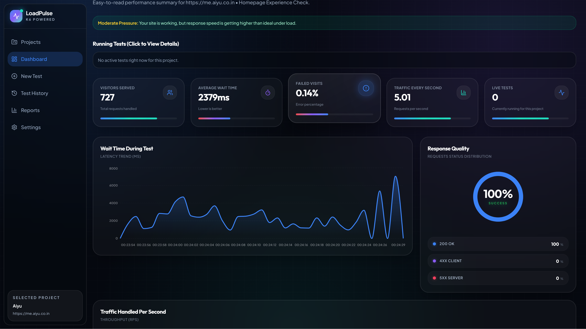
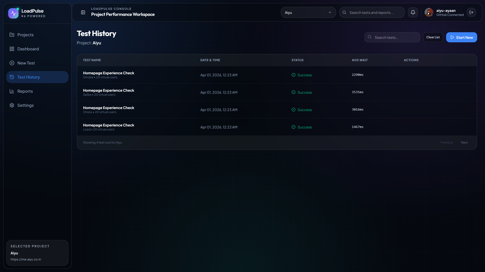
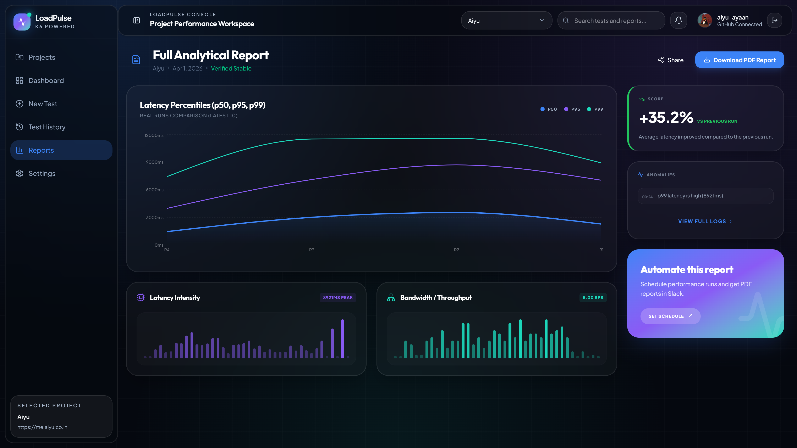

# LoadPulse

LoadPulse is a project-based website performance testing workspace built with React, Node.js, MongoDB, Socket.IO, and k6.

It is designed to help teams run load tests, watch live metrics, review historical runs, and share access to specific projects without making the UI feel too technical.



## Status

This project is still under active development.

That means:
- some flows are still evolving
- some UI areas may change
- you may still run into bugs or unfinished edges

## What LoadPulse Can Do Today

- Create multiple projects, each with its own website URL
- Run k6-powered tests for different projects at the same time
- Stream live run data to the dashboard with Socket.IO
- Keep per-project test history in MongoDB
- Open detailed run pages for individual test sessions
- Show project-level reports and recent performance summaries
- Share project access by email with teammates
- Automatically match shared access when a user later signs in with the same email
- Support local username/password auth
- Support optional GitHub login
- Support optional authenticator-based 2-step verification
- Show in-app notifications for test lifecycle events

## Screenshots

### Login


### New Test


### Test History



### Reports



## Product Structure

- `Projects`: create and manage monitored websites
- `Dashboard`: current project overview plus running and recent test activity
- `New Test`: configure and launch a new test with an editor-style script panel
- `Test History`: browse previous runs for the selected project
- `Reports`: project-focused analytical summary view
- `Settings`
  - `User Settings`: username, email, profile photo
  - `Security`: password, GitHub linkage, authenticator setup
  - `Access Management`: share the selected project with other users

## Tech Stack

- Frontend: React, TypeScript, Vite, Tailwind CSS, Framer Motion, Recharts
- Backend: Node.js, Express, Socket.IO
- Database: MongoDB with Mongoose
- Load testing: k6
- Auth: JWT, optional GitHub OAuth, optional TOTP 2FA

## Requirements

Before running locally, make sure you have:

- Node.js 20+
- MongoDB
- k6 installed and available in `PATH`

## Environment Setup

Create a `.env` file from `.env.example`.

Current environment template:

```env
FRONTEND_PORT=5173
BACKEND_PORT=4000

CLIENT_ORIGIN=http://localhost:5173
VITE_API_PROXY_TARGET=http://localhost:4000

MONGODB_URI=mongodb://localhost:27017
MONGODB_DB=loadpulse

# Optional: if empty, server generates a temporary secret on startup.
AUTH_JWT_SECRET=

# Optional GitHub OAuth login
GITHUB_CLIENT_ID=
GITHUB_CLIENT_SECRET=
GITHUB_CALLBACK_URL=http://localhost:4000/api/auth/github/callback

MAX_SERIES_POINTS=180
MAX_PERCENTILE_SAMPLES=5000
```

## Environment Notes

- `FRONTEND_PORT` controls the Vite dev server locally
- `BACKEND_PORT` controls the Express + Socket.IO server locally and in Docker
- `CLIENT_ORIGIN` should point to the frontend URL used by the browser
- `VITE_API_PROXY_TARGET` is used by Vite to proxy `/api` and `/socket.io`
- `AUTH_JWT_SECRET` should be set in production so auth remains stable across restarts
- If GitHub OAuth env values are not present, the app falls back to normal local sign-in/sign-up

## Local Development

Install dependencies:

```bash
npm install
```

Run frontend and backend together:

```bash
npm run dev
```

Useful scripts:

```bash
npm run dev
npm run dev:client
npm run dev:server
npm run lint
npm run build
npm run start
```

Default local URLs:

- Frontend: [http://localhost:5173](http://localhost:5173)
- Backend API: [http://localhost:4000](http://localhost:4000)

If you change the ports in `.env`, update `CLIENT_ORIGIN`, `VITE_API_PROXY_TARGET`, and if needed `GITHUB_CALLBACK_URL` to match.

## Authentication Flow

- If no users exist yet, the sign-in page starts in account creation mode
- Users can create an account with:
  - username
  - email
  - password
- Users can sign in with:
  - username + password
  - GitHub OAuth if configured
- If 2-step verification is enabled, the login flow asks for an authenticator code before access is granted

## Project Access Model

- Access is project-specific
- A user can be granted:
  - view access
  - run access
- Sharing is email-based
- If a project is shared to an email address before that person signs up, access is attached automatically once they log in with the same email later
- This also works for GitHub login when the GitHub account uses the same email

## Docker

The repository includes:

- `Dockerfile`
- `docker-compose.yml`

Run with Docker Compose:

```bash
docker compose up --build
```

Port behavior in Docker:

- Host/public app port: `FRONTEND_PORT`
- Container app port: `BACKEND_PORT`

Example:

```env
FRONTEND_PORT=8080
BACKEND_PORT=5000
CLIENT_ORIGIN=http://localhost:8080
GITHUB_CALLBACK_URL=http://localhost:8080/api/auth/github/callback
```

With that setup:

- the app opens at `http://localhost:8080`
- the Node server listens on port `5000` inside the container

## Main API Surface

- `GET /api/projects`
- `POST /api/projects`
- `DELETE /api/projects/:id`
- `POST /api/tests/run`
- `GET /api/tests/history?projectId=...`
- `GET /api/tests/:id`
- `DELETE /api/tests/:id`
- `GET /api/dashboard/overview?projectId=...`
- `GET /api/reports/summary?projectId=...`
- `POST /api/auth/signin`
- `POST /api/auth/signup`
- `GET /api/auth/me`

## Notes For Production

- Set a strong `AUTH_JWT_SECRET`
- Configure GitHub OAuth only if you want GitHub login
- Make sure MongoDB is reachable from the container or host environment
- Keep k6 installed in the runtime environment if you are not using Docker

## Known Reality

LoadPulse is already useful, but it is not finished yet.

Please expect:

- rough edges in some flows
- ongoing UI and permission improvements
- occasional bugs while the product is still being shaped
